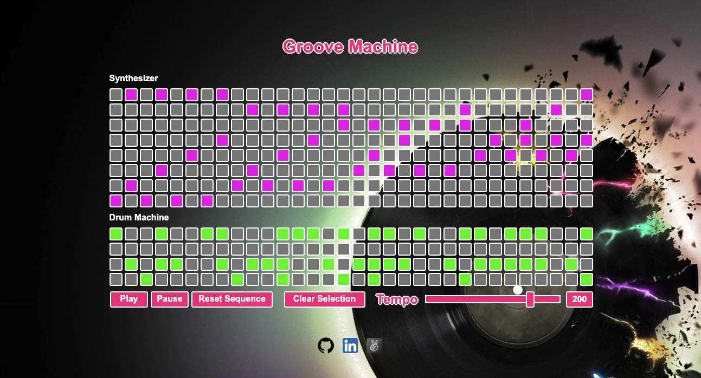

# Welcome to Groove Machine

Groove Machine is a 32 step sequencer with an 8 track, aeolian mode, tone selection grid and a 4 track Drum Machine with which users can create and manipulate original and groovy loops.

[Check it out here!](https://siascone.github.io/grooveMachine/)

## Technologies Used

Groove Machine was constructed utilizing a combination of JavaScript, Tone.js, HTML and CSS. JavaScript was used for the main logic along with Tone.js to generate the various sound samples. HTML was used to structure the application and CSS was used for styling.

## Features

### Tone and Rhythm Selection

### Step Sequence

### Playback and Reset

## Planned Future Features

* Volume controle.
* Scale key and drum selection.
* Loop recording, playback and sharing.

